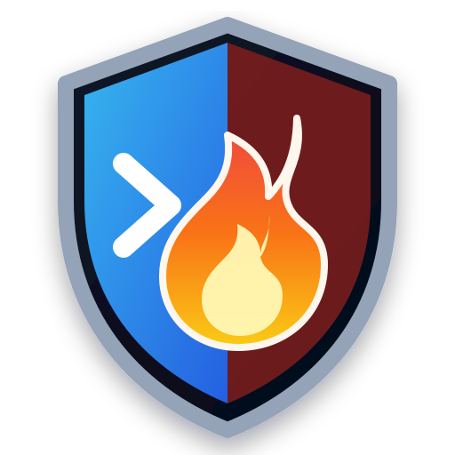

<p align="center"></p>

# BeforeRun CLI

This package builds the `beforerun` command-line application.

```bash
go install github.com/theworker02/beforerun/cmd/beforerun@latest
beforerun scan . --fail-on high
```

The CLI supports text and JSON reports, configurable severity thresholds, ignore paths, quiet mode, and version output.
